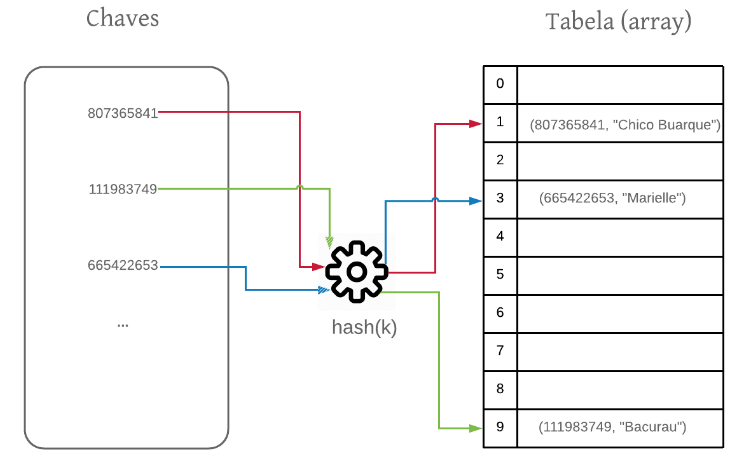
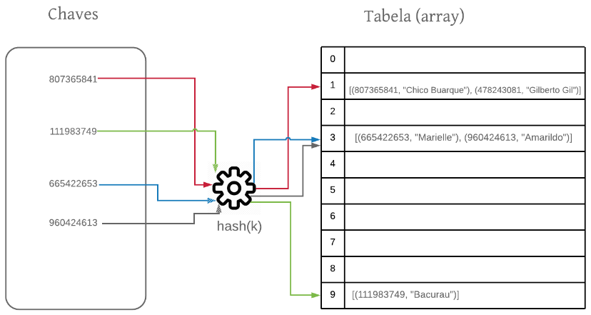

# Tabela Hash

Referência: [Estruturas de Dados e Algoritmos - João Arthur](https://joaoarthurbm.github.io/eda/posts/hashtable/)

## Tabela de Acesso Direto

É uma estrutura de dados (vetor ou array) onde cada elemento é armazenado diretamente em um índice que corresponde ao valor da sua própria chave. Exemplo: Counting Sort.

- Indexação Direta: O índice da tabela representa o dado em si
    - ex: a chave 10 é armazenada na posição 10 do vetor.

- Acesso O(1): A busca, inserção e remoção ocorrem em tempo constante, pois o computador vai diretamente ao endereço de memória.

- Uso de Memória: É uma estrutura extremamente <ins>ineficiente</ins> e desperdiça muito espaço se as chaves forem grandes, esparsas ou não-numéricas 
    - ex: armazenar as matriculas de computação exigiria uma tabela com bilhões de posições vazias (10¹¹) e, mesmo isso sendo possível, uma grande parte desse array não seria utilizada, pois o padrão usado para criar as matrículas baseia-se no ano, período de entrada e posição de entrada no vestibular e, por isso, exclui uma grande quantidade de números no intervalo [00000000000, 99999999999]. 

## Solução 

Queremos mapear valores inteiros grandes (ex: 87562874658) para índices de um array. 



A ideia é criar essa função de mapeamento `(hash(chave))` entre o valor da chave e um inteiro (hash) que seja um índice válido no array. 

Usando essa função conseguimos mapear as chaves para os índices do array e conseguimos então armazenar nossos objetos. Os objetos, nesse caso, são chamados de valores. Assim, na tabela armazenamos os pares <chave, valor>. Como a chave é tipicamente um atributo do objeto, essa redundância é bem comum. Isto é, armazenamos a chave e o objeto, que por sua vez contém a chave.

### Características Importantes

1. **A função hash(chave) deve ser determinística.** Para uma determinada chave a função sempre retorna o mesmo valor de hash.

2. **Por ser utilizada como uma função de indexação.** A função de hash deve sempre retornar um valor de hash dentro dos limites da tabela [0, N−1], onde N é o tamanho da tabela.

3. **Uniforme.** Todos os índices do array devem ter aproximadamente a mesma chance de serem mapeados pela função dehash. Essa característica é importante para distribuir os elementos uniformemente pela tabela.

4. **A função de hash deve ser executada em tempo constante O(1).**


### Implementação 

```java 
private int hash(int chave) {
    return chave % tabela.length;
}
```

#### Por que módulo?
Primeiro porque sempre vai gerar um inteiro dentro do intervalo de índices válidos do array. Segundo porque para uma mesma chave, a função sempre retorna o mesmo hash.

$$
\begin{aligned}
807365841 \pmod{10} &= 1 \\
111983749 \pmod{10} &= 9 \\
665422653 \pmod{10} &= 3
\end{aligned}
$$

## Colisões

***"E se duas chaves distintas forem mapeadas para a mesma posição na tabela?"***

### Resolução de colisões por encadeamento

Ao invés de armazenarmos um objeto em uma posição da tabela, passamos a armazenar uma lista de objetos. Essa lista será composta de todos os objetos cujos hashes são iguais.



> Importante aqui destacar que esses objetos não possuem a mesma chave, mas sim o mesmo hash. Não há elementos com a mesma chave em uma tabela hash. **Não há elementos com a mesma chave em uma tabela hash.**

- **Impacto das Colisões:** O uso de listas para tratar colisões faz com que o tempo de execução deixe de ser sempre constante, $O(1)$, exigindo a iteração sobre os elementos da lista.

- **Pior Caso - $O(n)$:** Ocorre se a função de hash mapear todos os elementos para o mesmo índice. A busca passa a exigir a iteração por todos os elementos ($n$).

- **Fator de Carga ($\alpha$):** Representa o tamanho médio das listas na tabela, calculado pela fórmula $\alpha = n/m$ (onde $n$ é o número de elementos e $m$ o tamanho da tabela).

- **Desempenho Médio:** Considerando que o cálculo da função de hash leva tempo constante $O(1)$, o tempo médio de execução das operações básicas na tabela é dado por $T(n) = 1 + \alpha$.

## Funções de Hash

> **O Problema de Funções Simples:** Utilizar o resto da divisão por 10 (que extrai apenas o último dígito) ou por números redondos (como 100) não é uma boa prática. Isso gera um alto número de colisões, pois chaves com padrões semelhantes acabam mapeadas para a mesma posição.

### Método da Divisão (Uso de Números Primos)
Uma excelente estratégia para evitar colisões é definir o tamanho da tabela como um número primo. A função fica definida como:
$$hash(chave) = chave \\% m$$ (onde $m$ é um número primo).

*Exemplo prático:* Mudar o tamanho de uma tabela de 100 para 101 reduziu as colisões de 60 para zero em um mesmo conjunto de dados.

### Método da Multiplicação

É uma estratégia alternativa que utiliza uma constante decimal ($A$) e o tamanho da tabela ($m$). A fórmula matemática da função é definida por:

$$hash(chave) = int(((chave \times A)\\% 1)\times m)$$


 **Passos do Método da Multiplicação:**
1. Multiplicar a chave pela constante decimal $A$.
2. Extrair apenas a parte fracionária do resultado (a operação `% 1`).
3. Multiplicar essa parte fracionária pelo tamanho da tabela ($m$).
4. Extrair a parte inteira do valor final, que será o índice exato do hash.
